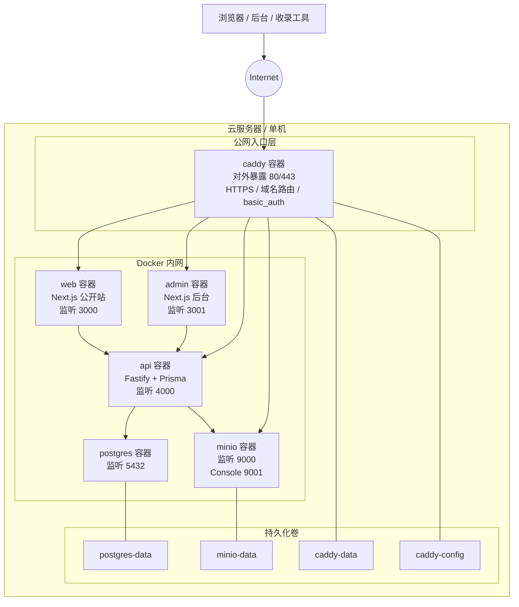

# XBlog

XBlog 是一个内容型博客系统，不只是静态展示站，而是把“内容生产、内容分发、后台编辑、资源存储、收录入口”串成一条完整链路。

它目前的定位是：先稳定跑在单机环境里，再按需要继续演进到更成熟的生产架构。

## 核心能力

- 公开站展示首页、分类页、文章页等内容。
- 管理后台支持文章编辑、分类管理、封面资源管理、token 管理和站点内容维护。
- 后端 API 负责登录鉴权、文章与分类数据、公开内容接口、上传、收录入口和健康检查。
- 支持对象存储，用于保存封面图、上传资源和其他静态资产。
- 支持构建期与运行期分离的环境配置，便于上线。

## 技术栈

下面先给一个更中立的背景：前端主流方案通常包括 `Vue / React / Angular`，后端主流方案通常包括 `Java / Python / Node.js / Go / C#`。XBlog 选的是其中一条更适合当前项目形态的路线。

| 层 | XBlog 选型 | 作用 | 为什么选它 | 常见替代方案 |
|---|---|---|---|---|
| 前端框架 | `Next.js 16` | 公开站和管理后台 | 把路由、渲染、数据获取、构建和部署放在一个框架里，适合既要 SEO 又要交互的内容站 | `Vue` / `React SPA + Vite` / `Nuxt` / `SvelteKit` |
| UI 框架 | `React 19` | 组件化 UI 基础 | 组件模型成熟，适合复杂页面和长周期维护，和 Next.js 配合最自然 | `Vue` / `Angular` / `Svelte` |
| 样式方案 | `Tailwind CSS 4` | 布局和视觉统一 | 原子化样式适合快速迭代，减少命名冲突，比大而全组件库更灵活 | `Bootstrap` / `CSS Modules` / 纯手写 CSS |
| 后端框架 | `Fastify` | API 服务 | 插件结构清晰、性能好、类型体验好，适合独立后端服务 | `Express` / `NestJS` / `Koa` |
| ORM / 迁移 | `Prisma` | 数据库访问与 schema 管理 | 类型安全、迁移清楚、和 TypeScript 协作顺，适合长期演进的内容系统 | 手写 SQL / `knex` / `sequelize` |
| 主数据库 | `PostgreSQL` | 持久化业务数据 | JSON、事务和复杂查询能力强，适合文章、分类、用户、token、会话等混合数据 | `MySQL` / `SQLite` |
| 对象存储 | `MinIO` | 图片和上传资源 | S3 兼容但可本地自托管，特别适合离线镜像部署和单机生产 | 本地磁盘目录 / 云厂商 S3 |
| E2E 测试 | `Playwright` | 浏览器级测试 | 能直接验证真实页面和登录、跳转、表单等交互，比只测接口更接近用户行为 | `Selenium` / 只做接口测试 |
| 单元测试 | `Vitest` | 后端逻辑和工具测试 | 启动快、TS 体验好，和现代前端工具链更贴合 | `Jest` / `Mocha` |
| 包管理 | `pnpm workspace` | Monorepo 依赖和构建 | 依赖去重好、磁盘占用低，适合 web/admin/api/contracts 共享代码 | `npm workspaces` / `yarn` |
| 编程语言 | `TypeScript` | 统一前后端代码基础 | 类型系统能显著减少接口和重构错误，适合长期维护的业务仓库 | `JavaScript` / `Go` / `Python` / `Java` |
| 反向代理 | `Caddy` | 公网入口和 HTTPS | 自动证书、配置简洁，单机 Docker 部署成本低 | `Nginx` / `Traefik` |

### 选型总结

- 如果看前端生态，`Vue / React / Angular` 都是主流，XBlog 选 `Next.js + React` 是为了把“内容站 + 后台 + SSR/SEO”放进同一套框架。
- 如果看后端生态，`Java / Python / Node.js / Go` 都是主流，XBlog 选 `Node.js + Fastify + TypeScript` 是为了让前后端语言统一、部署简单、迭代速度快。
- 如果看数据库和存储，`PostgreSQL + MinIO` 的组合比“把文件丢到容器里”更适合真实生产和后续演进。

## 术语说明

如果你对上面这些名字不熟，可以先把它们理解成下面这些“日常说法”：

- `Next.js`：做网页项目的“大框架”，像是前端界的“总装车间”，页面、路由、渲染、打包都能一起管。
- `React`：做界面的“组件工具箱”，把页面拆成一个个小零件来拼装。
- `Tailwind CSS`：一种“直接用现成小积木写样式”的方式，不用先想很多 CSS 类名。
- `Fastify`：后端接口框架，像是 API 的“服务柜台”，负责接收请求、返回数据、做校验。
- `Prisma`：数据库的“类型化中间层”，帮你少写很多 SQL，同时让代码和数据库结构对得更齐。
- `PostgreSQL`：真正存文章、用户、分类、token 的“主仓库数据库”。
- `MinIO`：自己搭出来的“文件仓库”，专门放图片、封面、上传资源。
- `Playwright`：自动点网页、自动看页面是否正常的“浏览器机器人”。
- `Vitest`：跑函数逻辑和后端工具测试的“自动检查器”。
- `pnpm workspace`：一个仓库里管多个子项目的“统一仓库管理员”。
- `TypeScript`：带类型提示的 JavaScript，像给代码加了“说明书和防呆线”。
- `Caddy`：放在最外面的“门卫 + 转发器”，负责域名、HTTPS 和把流量转给内部服务。

如果再对应到你更熟悉的主流技术，大致可以这样理解：

- `Next.js` 有点像 “`Vue` / `React` 做前端时，再加一层支持 SSR 和路由的整套方案”
- `Fastify` 有点像 “更现代、更清爽的 `Express`”
- `Prisma` 有点像 “把数据库操作包装得更安全的 ORM”
- `PostgreSQL` 就是传统意义上的“业务主数据库”
- `MinIO` 可以理解成“自建的对象存储，类似私有版 S3”
- `Caddy` 可以理解成“比 `Nginx` 更省心的反向代理和 HTTPS 工具”

## 仓库结构

- `apps/web`：公开站
- `apps/admin`：管理后台
- `apps/api`：后端服务
- `packages/contracts`：前后端共享的数据契约
- `deploy/production`：裸机 + systemd 生产部署方案
- `deploy/docker`：Docker 离线镜像部署方案
- `scripts`：辅助脚本

## 架构概览

XBlog 采用“前端 + 后端 + 数据库 + 对象存储 + 反向代理”的标准拆分方式。公开访问统一从 `Caddy` 进入，内部服务彼此通过 Docker 网络通信。

当前推荐的生产拓扑是单机 Docker compose 部署。对公网只开放 `Caddy`，其余服务全部留在 Docker 内网里。



## Docker 部署

### 容器职责

- `caddy`：公网入口，负责 `80/443`、HTTPS 证书、域名路由和反向代理。
- `web`：公开站前端。
- `admin`：管理后台前端。
- `api`：后端业务服务。
- `postgres`：数据库。
- `minio`：对象存储。

### 端口暴露

对公网暴露的只有 `80` 和 `443`。

容器内部常用端口：

- `web`：`3000`
- `admin`：`3001`
- `api`：`4000`
- `postgres`：`5432`
- `minio API`：`9000`
- `minio Console`：`9001`

### 数据卷

- `postgres-data`：保存 PostgreSQL 数据
- `minio-data`：保存对象存储数据
- `caddy-data`：保存证书和运行数据
- `caddy-config`：保存 Caddy 配置状态

原则很简单：

- `web / admin / api` 尽量无状态，容器坏了可以直接重建
- `postgres / minio / caddy` 需要持久化，不能把关键数据放在容器本体里

## 部署方式

如果你想先看当前的裸机生产方案：

- [deploy/production/README.md](deploy/production/README.md)

如果你准备走本地构建、离线传镜像、服务器导入的 Docker 路线：

- [deploy/docker/README.md](deploy/docker/README.md)
- [deploy/docker/directory-guide.md](deploy/docker/directory-guide.md)

## 本地开发

仓库采用 `pnpm workspace` 管理多包，多数常用命令都在根目录 `package.json` 里。

常见命令：

```bash
pnpm install
pnpm build
pnpm lint
pnpm test
```

按需启动单个服务：

```bash
pnpm dev:web
pnpm dev:admin
pnpm dev:api
```

## 设计重点

- `web` 和 `admin` 会用到构建期环境变量，尤其是 `NEXT_PUBLIC_*`，这类配置不能只靠运行时注入。
- `api` 直接对接 PostgreSQL 和 MinIO，负责核心业务逻辑和数据读写。
- `packages/contracts` 统一前后端共享类型，减少接口漂移。
- `deploy/docker` 采用蓝绿发布思路，方便后续升级和回滚。

## 说明

这个仓库还在持续演进中，部署方式也会跟着成熟度一起调整。
当前的原则是：

- 优先清晰
- 优先可回滚
- 优先好维护
