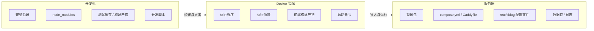

# XBlog 目录说明与部署取舍

这份文档只回答一件事：**如果你要把 XBlog 部署到云服务器，哪些目录该留在本地，哪些该进服务器，哪些该进 Docker 镜像。**

核心原则很简单：

- 开发机保留完整仓库
- 服务器只保留部署文件、镜像包、配置和数据卷
- 不要把源码树整份搬到云服务器

## 三栏对照



## 上线检查

### 开发机

- [ ] `apps/`：公开站、后台、API 的源码
- [ ] `packages/`：共享契约和公共代码
- [ ] `scripts/`：开发、测试、自动化脚本
- [ ] `node_modules/`：本地依赖
- [ ] `.next/`：Next.js 构建产物
- [ ] `test-results/`：测试结果
- [ ] `.playwright-cli/`：Playwright 缓存
- [ ] `output/`：导出产物或中间结果
- [ ] `xblog-next-app/`：独立示例/遗留模板，只有在你还要参考它时才保留关注

### 服务器

| 位置 | 用途 | 是否保留 |
|---|---|---|
| `/srv/xblog/images` | 离线镜像包 | 是 |
| `/srv/xblog/compose` | `compose.yml`、`Caddyfile`、发布脚本 | 是 |
| `/srv/xblog/data` | PostgreSQL、MinIO、Caddy 持久化数据 | 是 |
| `/srv/xblog/logs` | 运行日志 | 是 |
| `/etc/xblog` | `web.env`、`admin.env`、`api.env`、`caddy.env`、`minio.env` | 是 |

### Docker 镜像

- 运行程序本身
- 运行依赖
- 构建后的前端产物
- 必要的启动命令

### 不上服务器

- 源码树整份复制到服务器
- `node_modules/`
- `.next/`
- `test-results/`
- `output/`
- `xblog-next-app/`

## 推荐目录树

```text
/srv/xblog/
  images/
    xblog-web-20260319-1.tar
    xblog-admin-20260319-1.tar
    xblog-api-20260319-1.tar
    xblog-caddy-20260319-1.tar
  compose/
    compose.yml
    Caddyfile
    up-blue.sh
    up-green.sh
    migrate.sh
    smoke-test.sh
    switch.sh
    rollback.sh
  data/
    postgres/
    minio/
    caddy/
  logs/

/etc/xblog/
  web.env
  admin.env
  api.env
  caddy.env
  minio.env
```

## 最后一句

- `/srv/xblog` 放运行文件、镜像包和数据
- `/etc/xblog` 放配置和密钥
- 源码仓库留在开发机，不要整份搬到服务器
